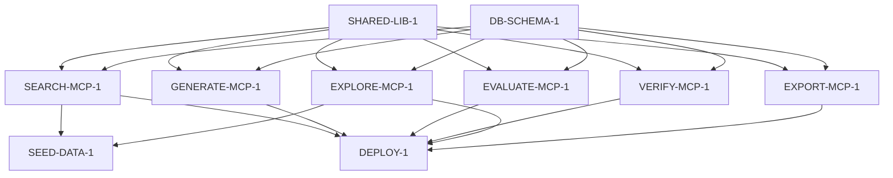

# The Drake Cascade — A Complete Walkthrough

**How Saimon was built — from product strategy to production, using Drake
governance at every layer.**

---

This document walks through Drake's full product development methodology.
Instead of abstract explanations, we use a real project: **Saimon**, a
self-extending platform of 6 atomic MCP services that powers research, content
generation, verification, and more. Saimon was built entirely within Drake's
cascade.

By the end, you'll understand both *what* Drake enforces and *why* each layer
matters — because you'll see a real product emerge from it.

---

## The Cascade at a Glance

```
Product Strategy  →  What are we building and why?
       ↓
Project Intake    →  How do we scope this project?
       ↓
ADRs              →  Why did we choose this approach?
       ↓
Slice Backlog     →  What work items deliver the vision?
       ↓
Dependency Tree   →  What blocks what?
       ↓
TDD Slices        →  RED → GREEN → REFACTOR → PROVE
       ↓
Evidence Contract →  Prove the work was done correctly
       ↓
Promotion Pipeline →  Ship with confidence
```

Each layer produces an artifact. Each artifact feeds the next. Every gate is
enforced — by tooling, not convention.

---

## Layer 1: Product Strategy

### What It Is

A document in your control-plane repo that answers: *what are we building, for
whom, and why?* It sets the direction for every project underneath it.

### Saimon's Strategy

Spencer Varadi, a solo technical founder, was managing 10 Docker containers,
~15 AI agents, a 90-tool jobhunter monolith, and fragile staging URLs — all on
a single 2-vCPU VPS. The system worked but was fragile. Maintenance consumed
time that should have gone to building.

The strategy was clear: **one platform, many tools.** A set of atomic MCP
services that any agent could use. Domain tools (job hunt, writing, research)
would add capabilities by registering content types and voice profiles — not
by building new MCPs.

Key decisions at this layer:
- **Single OpenClaw bot** for all life goals (job hunt, research, writing)
- **Self-extending platform** — the system learns new content types through research
- **Personal data isolation** — resume, salary, and applications in a private universe
- **No multi-user** — v1 is personal infrastructure, not SaaS

### Drake's Role

Drake doesn't define strategy content — but it defines *where* strategy lives
(`product_strategy.md` in the control-plane repo) and *who* owns it (the
Product Owner, not AI agents). Strategy is the only layer with zero automation —
every word is human-authored and human-reviewed.

---

## Layer 2: Project Intake

### What It Is

`project_intake.json` — a structured contract that scopes strategy into a
concrete project. It defines: users, workflow, success criteria, technology
profiles, validation commands, and human gates.

### Saimon's Intake

```json
{
  "project": {
    "id": "saimon",
    "name": "Saimon Platform",
    "github_slug": "sv-copilot/saimon",
    "integration_branch": "ai-dev"
  },
  "product": {
    "goal": "A self-extending platform of 6 atomic MCP services that share one knowledge graph and adapt to new content types via research-backed self-extension.",
    "target_users": [
      "Spencer Varadi (primary — personal infrastructure)",
      "OpenClaw agent (secondary — consumes MCPs as tools)",
      "VS Code Cline agent (tertiary — BUILD mode dispatch only)"
    ],
    "core_workflow": [
      "Agent requests content with a content type",
      "Platform checks: type registered? If not, self-extend via research",
      "Platform generates content grounded in knowledge graph sources",
      "Platform evaluates output against quality gates",
      "Agent receives scored, cited result"
    ],
    "success_criteria": [
      "6 MCPs deploy as Docker containers and respond to health checks",
      "Each MCP has ≤10 tools",
      "Content types can be registered at runtime via self-extension",
      "Platform survives DB wipe and re-seeds from seed_requests table"
    ]
  },
  "profiles": {
    "sensitivity": "elevated",
    "frontend": "none",
    "backend": "python-fastapi-default",
    "data": "postgres-with-embeddings"
  },
  "human_gates": [
    {
      "id": "HG-SAIMON-001",
      "question": "Operator approves destruction of existing knowledge graph before fresh start.",
      "blocks_automation": true
    }
  ],
  "validation": {
    "test": "python -m pytest tests/ -q",
    "lint": "ruff check research_shared/ mcp/",
    "build": "docker build -t saimon .",
    "smoke": "docker run --rm saimon search-mcp --health-check"
  }
}
```

Notice the `human_gates` — before any automation can destroy the existing
knowledge graph, a human must explicitly approve. Drake doesn't let agents
make destructive decisions.

### Drake's Role

The orchestrator reads `project_intake.json` before promoting any slice. If the
file is missing or invalid, nothing dispatches. The validation commands defined
here become the commands the runner executes. The sensitivity profile gates what
data can be stored.

---

## Layer 3: Architecture Decisions (ADRs)

### What It Is

An Architecture Decision Record captures *why* a technical direction was chosen —
context, alternatives considered, consequences accepted. Drake provides the
template at `templates/adr.md`.

### Saimon's ADR

The platform redesign required 33 interconnected decisions. Rather than 33
separate ADRs, one umbrella ADR captured them all with a decisions log table:

| # | Decision | Choice | Rationale |
|---|----------|--------|-----------|
| 1 | MCP Transport | HTTP/Docker | Multiple consumers, independent lifecycle |
| 2 | Backend Role | Direct-to-DB | Fresh start, no legacy to preserve |
| 4 | Knowledge Graph | Start fresh | Sacrifice everything. Rebuild from seed |
| 10 | Content Types | Self-referential single table | Slash naming. Inheritance at query time |
| 14 | Jobhunter | 90 tools → 2 MCPs + registrations | Delegate search/gen/eval to platform |
| 16 | Self-Extension | LLM + two-level taxonomy | Platform learns new content types |
| ... | ... | ... | ... |

The full ADR is at `saimon/.docs/adr/2026-07-26-platform-redesign.md`. It
captures context (the organic complexity that motivated the redesign),
alternatives considered (keep monolith — rejected; keep backend — rejected),
consequences (downtime during migration, simpler ops going forward), and
risks with mitigations.

### Drake's Role

Drake provides the ADR template but doesn't enforce ADR creation — that's a
human gate in `project_intake.json`. Slices reference ADRs in their detail
docs, creating traceability from implementation back to decision.

---

## Layer 4: Slice Backlog

### What It Is

`slice_backlog.md` — a ranked list of work items, each scoped small enough for
a single PR. The Product Owner owns prioritization. The Engineering Lead
validates technical feasibility.

### Saimon's Backlog (Phase 1 Excerpt)

| Rank | Slice | What | Size | Deps |
|------|-------|------|------|------|
| #1 | SHARED-LIB-1 | Extract shared library: envelope, LLM, DB, auth, resilience, audit | small | — |
| #2 | DB-SCHEMA-1 | Create platform schema: content_types, voice_profiles, quality_gates, etc. | small | — |
| #3 | SEARCH-MCP-1 | Extract search MCP: web search, discovery, knowledge graph query. ~6 tools | medium | SHARED-LIB-1, DB-SCHEMA-1 |
| #4 | GENERATE-MCP-1 | Extract generate MCP: content gen, type registry, voice profiles. ~7 tools | medium | SHARED-LIB-1, DB-SCHEMA-1 |
| #5 | EVALUATE-MCP-1 | Extract evaluate MCP: quality gates, AI detection, text comparison. ~7 tools | medium | SHARED-LIB-1, DB-SCHEMA-1 |
| #6 | VERIFY-MCP-1 | Extract verify MCP: claim verification, method tiers. ~4 tools | small | SHARED-LIB-1, DB-SCHEMA-1 |
| #7 | EXPLORE-MCP-1 | Extract explore MCP: multi-source synthesis, deep research. ~6 tools | medium | SHARED-LIB-1, DB-SCHEMA-1 |
| #8 | EXPORT-MCP-1 | Create export MCP: format conversion, text-to-speech. ~5 tools | medium | SHARED-LIB-1, DB-SCHEMA-1 |
| #9 | SEED-DATA-1 | Seed data requests for knowledge graph refill | small | EXPLORE-MCP-1, SEARCH-MCP-1 |
| #10 | DEPLOY-1 | Deploy 6 MCPs to VPS. Wire to Postgres. Health checks. | medium | All MCP slices |

Every entry answers: what, why, size, dependencies, risk level, and
automation eligibility. An agent receiving this slice can implement it without
asking "what does this mean?"

### Drake's Role

The backlog feeds the dependency tree. Drake's orchestrator reads the tree, not
the backlog — but the backlog is where the PO expresses intent. The tree is
where the EL encodes dependencies.

---

## Layer 5: Dependency Tree

### What It Is

`slice_dependency_tree.json` — a machine-readable graph of what blocks what.
The orchestrator reads it to determine promotion order and fan-out. Every
slice is a node with dependencies, blockers, and state.

### Saimon's Tree



Two parallel tracks at the start (SHARED-LIB-1 + DB-SCHEMA-1), then 6 parallel
MCP extractions, then 2 dependent slices. The orchestrator handles fan-out
automatically.

### The Orchestrator's View

```
CYCLE 1: SHARED-LIB-1 + DB-SCHEMA-1 both ready → fan-out, dispatch both
CYCLE 2: Both validated → 6 MCPs promoted to ready → fan-out, dispatch all 6
CYCLE 3: All 6 validated → SEED-DATA-1 + DEPLOY-1 promoted → dispatch both
```

No meetings. No Slack messages. The tree IS the plan.

### Drake's Role

Drake provides the tree schema (`slice_dependency_tree.example.json`) and the
validation script (`validate_slice_dependency_tree.py`). The script rejects
cycles, missing dependencies, and slices without detail docs. The orchestrator
reads the validated tree and executes.

---

## Layer 6: TDD Slices — RED → GREEN → REFACTOR → PROVE

### What It Is

Every slice is implemented using test-driven development. This is not a
suggestion — it's a pipeline requirement enforced at two independent gates.

### Saimon's SHARED-LIB-1

**RED**: The VPS runner writes failing tests first.

```python
# tests/shared/test_envelope.py
def test_envelope_ok_response():
    e = Envelope(ok=True, tool="search.web_v1", status="ok", 
                 data={"results": []}, error=None)
    assert e.ok
    assert e.status == "ok"

# tests/shared/test_llm.py
def test_fail_closed_when_no_api_key():
    with pytest.raises(LLMUnavailableError):
        build_llm_client(api_key=None)

# tests/shared/test_resilience.py
def test_circuit_breaker_opens_after_threshold():
    cb = CircuitBreaker(threshold=3, recovery_seconds=60)
    for _ in range(3):
        cb.record_failure()
    assert cb.is_open()
```

`pytest` output: **0/12 pass — all RED.** This is correct. The guardrail
checks: test files exist, test files >100 bytes, recognized test patterns.
Passed.

**GREEN**: Implement the minimum code to make tests pass.

```python
# research_shared/envelope.py
@dataclass
class Envelope:
    ok: bool
    tool: str
    status: str  # ok | accepted | invalid_request | degraded | ...
    data: dict | None = None
    error: str | None = None

# research_shared/llm.py
def build_llm_client(api_key: str | None = None) -> OpenAI:
    if not api_key:
        raise LLMUnavailableError("No API key configured")
    return OpenAI(api_key=api_key, base_url="https://api.deepseek.com/v1")
```

`pytest` output: **12/12 pass — GREEN.**

**REFACTOR**: Add docstrings, type hints, extract duplicate error handling.
`pytest` still: **12/12 pass.**

**PROVE**: The runner runs full validation and assembles evidence.

### Drake's Role

The guardrail (`guardrail.py`) rejects output with zero test files — before
any code is written. The verification gate (`orchestrator.py`) checks the
final diff — if zero test files were modified, the run fails. Two independent
checks, one non-negotiable rule: **no code ships without tests.**

---

## Layer 7: Evidence Contract

### What It Is

`pipelineRunEvidence` — a machine-readable JSON object produced by the runner
after every slice. It proves the work was done correctly. It's attached to
every PR body so reviewers can verify without running tests themselves.

### Saimon's SHARED-LIB-1 Evidence

```json
{
  "slice_id": "SHARED-LIB-1",
  "repo_id": "saimon",
  "test_files_changed": 3,
  "test_results": {
    "passed": 12,
    "failed": 0,
    "skipped": 0
  },
  "files_written": [
    "research_shared/envelope.py",
    "research_shared/llm.py",
    "research_shared/db.py",
    "research_shared/auth.py",
    "research_shared/resilience.py",
    "research_shared/audit.py"
  ],
  "total_lines_added": 612,
  "validation": {
    "lint": {"command": "ruff check research_shared/", "exit_code": 0},
    "compile": {"command": "python -m compileall research_shared/", "exit_code": 0}
  },
  "model": "deepseek-chat",
  "duration_ms": 89423,
  "retry_count": 0,
  "timestamp": "2026-07-26T14:30:00Z"
}
```

The reviewer sees this and knows: 3 test files, 12 passing tests, 6 files
written, no retries, all validation clean. Merge with confidence.

Over time, evidence accumulates in `runner-log.jsonl`, making the pipeline
measurable: success rates by model, tokens per slice, which slices need
retries.

### Drake's Role

Drake defines the evidence contract schema (`evidence-contract.schema.json`).
The runner must produce valid JSON. The verification gate checks it exists and
conforms. Without evidence, no PR.

---

## Layer 8: Promotion Pipeline

### What It Is

Branches with gates: `slice/*` → `ai-dev` → `dev` → `main`. Each promotion
has a specific gate. No branch is skipped.

### Saimon's Journey Through the Pipeline

```
slice/SHARED-LIB-1
  │  Runner implements. RED→GREEN→REFACTOR→PROVE.
  │  Gate: Local validation (tests, lint, compileall)
  │
  ▼
ai-dev
  │  PR merged by human reviewer.
  │  Runner pushes tree-sync: "SHARED-LIB-1: validated"
  │  Orchestrator detects: SEARCH-MCP-1 deps now satisfied → promoted to ready.
  │  Gate: Local validation documented in PR body.
  │
  ▼
dev (promotion PR)
  │  Release manager creates ai-dev → dev PR.
  │  GitHub Actions CI runs: lint, typecheck, test, deploy to staging.
  │  Smoke test staging.
  │  Gate: CI must be green. Status check required.
  │
  ▼
main (release PR)
  │  Release manager creates dev → main PR.
  │  GitHub Actions CI runs: full suite, deploy to production.
  │  Smoke test production.
  │  Gate: CI must be green. Status check required.
  │
  ▼
Released. Saimon SHARED-LIB-1 is in production.
```

### The Branch Policy

| Branch | Who Pushes | Merge Gate |
|--------|-----------|------------|
| `slice/*` | AI agent (VPS runner) | Local validation |
| `ai-dev` | Human merges PR | Local validation (documented) |
| `dev` | Human merges promotion PR | GitHub Actions CI (required) |
| `main` | Human merges release PR | GitHub Actions CI (required) |

### Drake's Role

Drake defines the branch model in `AGENTS.md` and enforces it through
convention and CI configuration. The orchestrator handles tree sync
automatically after merge — so the planning state always reflects what's
actually shipped. Promotion gaps are detectable: `git log ai-dev --not dev`
shows exactly what's waiting.

---

## The Complete Cycle

Here's what happened, end to end, to build Saimon's shared library:

```
1. Spencer wrote product strategy: "One platform, many tools."
2. Spencer filled project_intake.json: Saimon, 6 MCPs, elevated sensitivity.
3. Spencer + Cline wrote the ADR: 33 decisions, documented alternatives.
4. Spencer ranked the backlog: SHARED-LIB-1 first, blocks everything.
5. Cline added nodes to the dependency tree: 2 parallel tracks, 10 slices.
6. Orchestrator promoted SHARED-LIB-1 to ready. Dispatched to VPS runner.
7. Runner wrote failing tests (RED), implemented (GREEN), refactored.
8. Runner produced evidence: 3 test files, 12 tests, 0 retries.
9. Runner opened PR. Spencer reviewed evidence, merged.
10. Runner synced tree: SHARED-LIB-1 validated. SEARCH-MCP-1 unblocked.
11. Later: promotion PR to dev. CI green. Promotion PR to main. Released.
```

At no point did anyone ask "what should I work on next?" or "is this tested?"
or "what's blocking what?" The cascade answered every question before it was
asked.

---

## Why This Matters

Drake isn't a project management tool bolted onto a codebase. It's a
**methodology encoded in artifacts and enforced by automation.** Every layer:

- **Has a specific artifact** — not a vague "we should document this"
- **Has a specific owner** — human or AI, never ambiguous
- **Has a specific gate** — what must pass before moving to the next layer
- **Feeds the next layer** — strategy informs intake, intake informs ADRs,
  ADRs inform slices, slices produce evidence, evidence gates promotion

A new team member — or an AI agent — can trace any line of production code
back through: which slice implemented it → which ADR decided the approach →
which project intake scoped it → which product strategy motivated it.

That's Drake.
